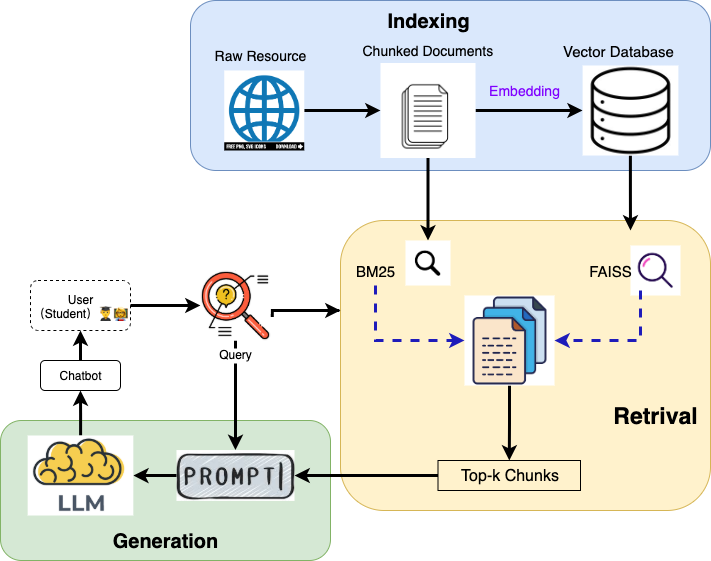

# A RAG-based Chatbot for University Course Assistance - Summer Semester 2025

> **🎓 University Course Assistance Chatbot** 

---

## Overview

This repository hosts the code for a semester-long project on building and experimenting with Retrieval-Augmented Generation (RAG) systems. A chatbot designed to answer university course-related queries using website information and open-source language models.

---

## Folder Structure
<pre> 

baseline/
├── data
│   ├── cleaned_json
│   │   └── *** All cleaned data in json format from university website**
│   │   
│   └── pdfs
│       └── *** Website data in .pdf format is placed here ***
├── evaluation
│   └── evaluation_unsupervised.py
├── generator
│   └── generator.py
├── llms
│   ├── Place the suitable LLM model here (Dowloadable from https://raw.githubusercontent.com/nomic-ai/gpt4all/main/gpt4all-chat/metadata/models2.json)
│   └── README.MD
├── logs
│   └── RAGPipeline.log
├── pipeline.py
├── requirements.txt
├── retriever
│   └── retriever_bge_m3.py
├── runPipeline.py
├── test
│   ├── F1_score_calculation.py
│   ├── input
│   │   ├── f1_qa_input.json
|   |   ├── bert_qa_input.json
│   │   └── questions.txt
│   ├── outputs
│   │   ├── answers.txt
│   │   └── f1_output.txt
│   ├── RAGPipelineTest_bge_m3.py
│   └── test_retriever.py
└── util
    ├── fileUtil.py
    └── logger_config.py


</pre>
## Steps to run chatbot
 1. **Make sure your are currently inside the /baseline folder**
 2. **Place the LLM file in the baseline/llms folder:**  https://raw.githubusercontent.com/nomic-ai/gpt4all/main/gpt4all-chat/metadata/models2.json
 3. **To install the required packages:** Run the below commands in the terminal to install the requiered package
                ```
                    conda env create -f environment.yml;
                    conda activate rag-uni-bot
                 ```
 
 4. **To run the chatbot:** python runPipeline.py
 5. **To access the chatbot UI:** Access the url that is displayed once the server starts. Eg: http://127.0.0.1:xxxx


## Steps to setup and run testcases

### To get answers with BERT Score
 1. **Make sure your are currently inside the /baseline folder**
 2. **To test with new question, add your question to:** test/input/bert_qa_input.json
 3. **To run the RAGPipeline with test data/questions:** python test/Bert_score_calculation.py
 5. **Output file:** test/output/bert_output.txt
 

 ### To get answers with f1 Score, recall and precision 
 1. **Make sure your are currently inside the /baseline folder**
 2. **To test with new question, add your question to:** test/input/f1_qa_input.json
 3. **To run the RAGPipeline with test data/questions:** python test/F1_score_calculation.py
 5. **Output file:** test/output/f1_output.txt
 
---
### 🧩 Architechture



## Retriever Module

The `Retriever` class in `retriever/retriever.py` implements hybrid document retrieval for RAG systems, combining dense and sparse methods to improve coverage.

1. **Load and index documents** (`.txt`, `.pdf`, `.json`) with overlapping chunking  
2. **Support hybrid retrieval** using dense vectors (BGE-M3) and BM25 with weighted score fusion  
3. **Optional reranking** with a cross-encoder for more accurate results  
4. **Track sources** so each chunk can be traced back to its original file  
5. **Save and load** FAISS and BM25 indexes for reuse

### Features
- Dense + sparse retrieval with score fusion  
- Optional cross-encoder reranker  
- Overlapping chunking based on tokenizer  
- Supports `.txt`, `.md`, `.pdf`, `.json` files  
- Source tracking for each chunk  
- Easy saving and loading of FAISS/BM25 index

## Generator Module

The `Generator` class in `generator/generator.py` utilizes a local LlamaCpp model for generating answers based on retrieved context, which is useful for question-answering systems.

1. **Load llm model**  Loads the first .gguf file from /llms directory 
2. **Generate answers** by combining a user query with relevant context chunks using a customizable prompt template
3. **Handle errors** to manage issues during model loading

## Others

1. **Log File**  : `logs/RAGPipeline.py`

---

## Reflections and Thoughts

The RAG-oriented chatbot developed offers information to users based on the generative model, which takes in users’ queries, retrieved top-k chunks and the
constructed prompt for answer generation. After the test, it is concluded that the chatbot mostly understands users’ queries in both German and English, locates the answers’ source correctly and outputs the expected information to the users in a
stable way. However, it still needs improvement in retrieving information from links and understanding the follow-up questions.

---


## Team Members

| Role   | Name            | GitHub Username |
| ------ | --------------- | --------------- |
| Member | Mengmeng Yu     | Linqiaoqiao2    |
| Member | Wenhui Deng     | deng-wenhui     |
| Member | Subhasri Suresh | subhasri-suresh |

---

